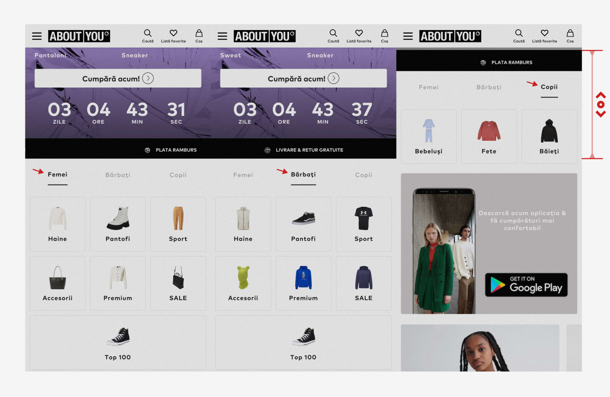
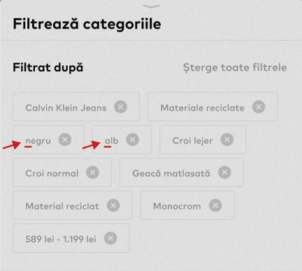
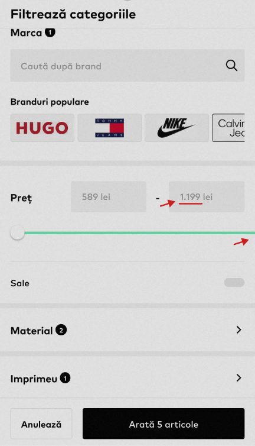

# Introduction

This document outlines the process I went through to create a manual and an automated end-to-end test for the business-critical path.

# Notes

Before starting the project, I spent ~2 hours refreshing my knowledge of TypeScript and creating a blank structure to use later. After the project, I took some time to document my process to provide context on how I approach tasks and created this file.

# Process

### Day 1

- Hour 1

  I explored the mobile site, created a basic diagram of the end-to-end flow, and gathered information on how my partner and some friends usually use the shop. I also took screenshots of each relevant page and examined the HTML structure for potential issues with locating or interacting with elements. Fortunately, I didn't encounter any problems.

- Hour 2

  I created a manual test script with the intention of automating each step afterward. However, I realized this was more than I could accomplish, so I focused on stripping out assertions for the automation pack.

### Day 2

- Hours 3 & 4

  I created the automated end-to-end test using Cypress. I encountered scrolling issues with some elements, which I resolved using `scrollBehavior`. Additionally, some uncaught exceptions were causing the test to fail, so I searched for a workaround and found a way to ignore those exceptions using `Cypress.on("uncaught:exception")`. I also spent extra time on my own trying different methods, such as intercepting API calls and waiting for them to finish responding, but unfortunately, I didn't succeed with any of them.

# Structure

```
Project
├─📁manualTestSteps > CriticalPath.csv // Manual steps Scenario
└─📁cypress
  ├─📁e2e > CriticalPath.cy.ts // Scenario
  ├─📁locators > Locators.ts // General locators class
  └─📁pages // Page classes
```

# Issues

Encountered several issues which I believe are worth mentioning:

- Homepage - The Kids tab option scrolls the page after being selected, whereas the Women and Men tabs don't exhibit this issue when switching between them



- Filters Flyout - The color filters don't have a capitalized first letter, whereas all other filters use this format, and the colors are displayed capitalized in the color section below as well



- Filters Flyout - The price slider overflowed to the right outside of the screen and the price was updated with a value outside the range; there were no items at that price


